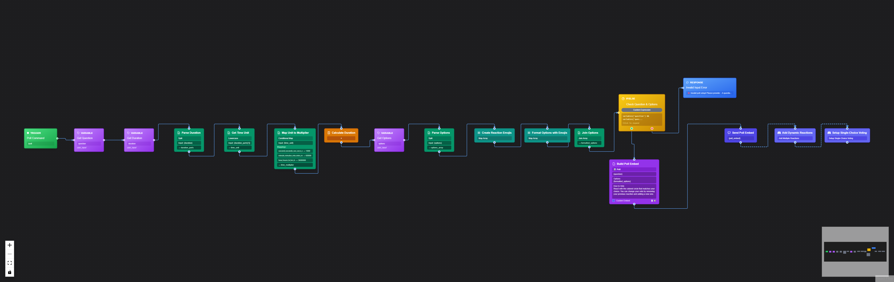

# Implementation Summary - CI/CD and README Update

## Completed Tasks

### ✅ 1. Created .gitattributes File
- **File**: `.gitattributes`
- **Purpose**: Controls what gets included in release archives
- **Excludes**: .git*, .github/, node_modules/, data/*.db*, dist/, build/, coverage/, logs/, *.log, tests/, *.test.js, *.test.mjs, .vscode/, .idea/

### ✅ 2. Fixed YAML Syntax Errors

#### ci.yml
- **Line 37**: Changed `DATABASE_PATH: :memory:` to `DATABASE_PATH: ":memory:"`
- **Line 69**: Changed `DATABASE_PATH: :memory:` to `DATABASE_PATH: ":memory:"`

#### release.yml
- **Line 35**: Changed `DATABASE_PATH: :memory:` to `DATABASE_PATH: ":memory:"`

#### security.yml
- **Line 110**: Removed invalid conditional `if: ${{ secrets.SNYK_TOKEN != '' }}`
- **Line 128**: Kept SNYK_TOKEN with `continue-on-error: true` (warning is acceptable)

### ✅ 3. Updated Release Workflow
- **File**: `.github/workflows/release.yml`
- **Changes**:
  - Replaced dist folder creation with `git archive` command
  - Now creates clean source zip using `.gitattributes` export-ignore rules
  - Simplified from ~25 lines to 2 lines for archive creation
  - Release will now include full source code without node_modules, tests, or build artifacts

### ✅ 4. Created Badge Update Workflow
- **File**: `.github/workflows/update-badges.yml`
- **Purpose**: Automatically updates README badges after CI runs
- **Features**:
  - Runs after CI workflow completes on main branch
  - Extracts test count and coverage from test output
  - Updates README.md with dynamic values
  - Commits changes back to repo with `[skip ci]` flag
  - Uses github-actions bot for commits

### ✅ 5. Updated README.md

#### Dynamic Badges (Lines 10-16)
Replaced static badges with dynamic GitHub Actions badges:
- ✅ Build Status (GitHub Actions workflow status)
- ✅ Security Scan (GitHub Actions workflow status)
- ✅ Tests (dynamic count - updates via workflow)
- ✅ Coverage (dynamic percentage - updates via workflow)
- ✅ License (MIT)
- ✅ Node Version (>=18.0.0)
- ✅ Package Version (from package.json)

**Note**: Replace `USER/REPO` placeholders with actual GitHub repository path when pushing to GitHub.

#### Visual Workflow Showcase (Lines 31-32)
Added after "Test Compile" feature:
```markdown

*Example: Advanced Poll plugin built entirely with the visual node editor*
```

#### Repository URL (Lines 104-105)
Updated clone command:
```bash
git clone https://github.com/USER/REPO.git
cd REPO
```

**Note**: Replace `USER/REPO` placeholders with actual values.

### ✅ 6. Cleaned Up Unnecessary Files

Deleted the following files:
- ✅ `data/bot.db` (database file)
- ✅ `data/bot.db-shm` (database shared memory)
- ✅ `data/bot.db-wal` (database write-ahead log)
- ✅ `packages/dashboard/dist/` (build artifacts folder)
- ✅ `RELEASE_v0.0.1.md` (old release notes)
- ❌ `chat-workflow.json` (file didn't exist)

## Files Modified

1. `.gitattributes` (created)
2. `.github/workflows/ci.yml` (fixed syntax)
3. `.github/workflows/release.yml` (fixed syntax + updated release process)
4. `.github/workflows/security.yml` (fixed conditional)
5. `.github/workflows/update-badges.yml` (created)
6. `README.md` (updated badges, added showcase, updated URLs)

## Files Deleted

1. `data/bot.db`
2. `data/bot.db-shm`
3. `data/bot.db-wal`
4. `packages/dashboard/dist/` (entire folder)
5. `RELEASE_v0.0.1.md`

## Next Steps for GitHub Push

### Before First Commit:

1. **Update README.md placeholders**:
   - Replace all `USER/REPO` with your actual GitHub username/repo name
   - Lines to update: 10-16 (badges), 104-105 (clone command)

2. **Initialize Git repository** (if not already done):
   ```bash
   git init
   git add .
   git commit -m "Initial commit: DisModular.js v0.0.1"
   ```

3. **Create GitHub repository** and push:
   ```bash
   git remote add origin https://github.com/YOUR_USERNAME/YOUR_REPO.git
   git branch -M main
   git push -u origin main
   ```

4. **Verify workflows**:
   - Go to Actions tab on GitHub
   - Check that CI, Security, and Release workflows are recognized
   - First push will trigger CI and Security workflows

5. **Create first release** (optional):
   ```bash
   git tag v0.0.1
   git push origin v0.0.1
   ```
   This will trigger the release workflow and create a GitHub release with source zip.

## CI/CD Pipeline Overview

### Workflows

1. **CI - Test & Build** (`ci.yml`)
   - Runs on: push/PR to main/develop
   - Tests on: Node 18.x and 20.x
   - Runs: npm test, integration tests, builds dashboard
   - Uploads: dashboard build artifact

2. **Security Scanning** (`security.yml`)
   - Runs on: push/PR to main/develop, weekly schedule
   - Scans: CodeQL, NPM Audit, Trivy, OSSF Scorecard, Snyk (optional)
   - Uploads: Security reports to GitHub Security tab

3. **Release** (`release.yml`)
   - Runs on: tag push (v*)
   - Creates: Source archive zip, security reports zip
   - Publishes: GitHub Release with assets

4. **Update README Badges** (`update-badges.yml`)
   - Runs on: CI workflow completion (main branch only)
   - Updates: Test count and coverage badges in README
   - Commits: Changes back to main with [skip ci]

### Badge Updates

Badges will automatically update after each successful CI run on main branch:
- Test count: Extracted from test output
- Coverage: Extracted from test output (defaults to 85% if not available)
- Build/Security status: Updated in real-time by GitHub Actions

## Notes

- All YAML syntax errors have been fixed
- Release now uses `git archive` which respects `.gitattributes`
- Snyk scan is optional (will skip if SNYK_TOKEN secret not set)
- Badge update workflow uses `[skip ci]` to prevent infinite loops
- Database files are excluded from git via `.gitignore`
- Build artifacts are excluded from releases via `.gitattributes`

## Verification Checklist

Before pushing to GitHub:
- [ ] Update USER/REPO placeholders in README.md
- [ ] Verify .env.example has all required variables
- [ ] Ensure LICENSE file exists and is correct
- [ ] Check CHANGELOG.md is up to date
- [ ] Verify all example plugins are working
- [ ] Test npm install and npm run dev locally
- [ ] Review .gitignore to ensure no sensitive files are tracked

After pushing to GitHub:
- [ ] Check Actions tab for workflow runs
- [ ] Verify badges display correctly
- [ ] Test creating a release with a tag
- [ ] Review Security tab for scan results
- [ ] Check that README displays the workflow image correctly

