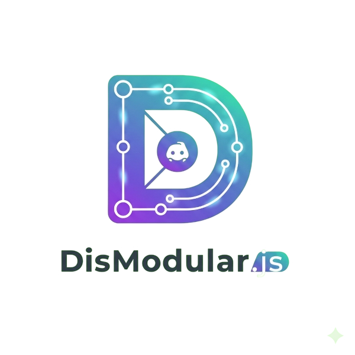
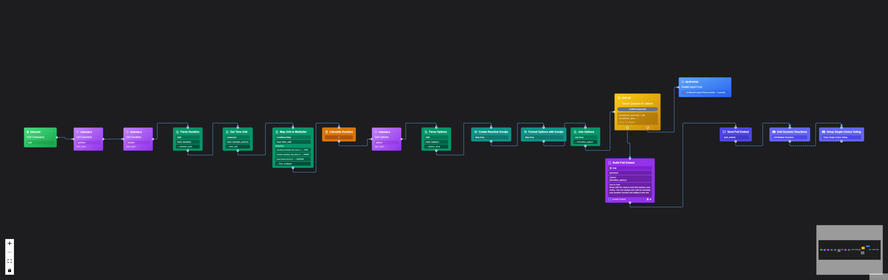

<div align="center">
  
  
  # DisModular.js

  A modular Discord bot framework with visual node-based plugin creation. Build sophisticated bot commands and interactions through an intuitive drag-and-drop interface — no coding required!

  **Version:** 0.0.3 • **License:** MIT • **Author:** fkndean_/theantihero

  [](https://github.com/theantihero/DisModular.js/actions/workflows/ci.yml)
  [](https://github.com/theantihero/DisModular.js/actions/workflows/security.yml)
  [](https://github.com/theantihero/DisModular.js/actions)
  [](https://github.com/theantihero/DisModular.js/actions)
  [](LICENSE)
  [](package.json)
  [](package.json)

  ---
</div>

## 🌟 Features

### 🎨 Visual Plugin Editor
- **Node-Based Workflow**: Create bot plugins by connecting nodes in a visual editor
- **20+ Node Types**: Triggers, variables, conditions, loops, HTTP requests, Discord embeds, and more
- **No Coding Required**: Build sophisticated plugins without writing code
- **Export/Import**: Share your plugin workflows as JSON files with the community
- **Context Menus**: Right-click menus and keyboard shortcuts for productivity
- **Test Compile**: Preview generated code before saving


*Example: Advanced Poll plugin built entirely with the visual node editor*

### 👑 Admin Dashboard
- **Modern UI**: Beautiful gradient design with glass morphism effects
- **Mobile Responsive**: Full mobile navigation and touch-friendly interface
- **User Management**: Add/remove admin privileges for Discord users
- **Real-time Analytics**: Command tracking, usage metrics, and performance monitoring
- **Settings Panel**: Configure bot prefix, cooldowns, logging, and more
- **Secure Auth**: Discord OAuth with role-based access control

### 🔌 Plugin System
- **Auto-Detection**: Drop plugin files into the folder for automatic loading
- **Dual Commands**: Support for both slash commands (`/poll`) and text commands (`!hello`)
- **Hot Reload**: Changes reflect immediately without bot restart
- **Sandboxed Execution**: Safe plugin execution using isolated-vm
- **Persistent State**: Plugins can store and retrieve data between executions

### 🛠️ Developer Features
- **Monorepo Structure**: Clean workspace organization with npm workspaces
- **MVVM Architecture**: Separation of concerns across all packages
- **Self-Hostable**: Single SQLite database, no external dependencies
- **Real-Time Updates**: File watching and automatic plugin synchronization
- **Comprehensive Logging**: Detailed logs for debugging and monitoring

## 🏗️ Architecture

The project follows a monorepo structure with three main packages:

```
dismodular.js/
├── packages/
│   ├── bot/        # Discord bot core with plugin system
│   ├── api/        # Express REST API server
│   ├── dashboard/  # React dashboard with visual editor
│   └── shared/     # Shared utilities and types
├── plugins/        # Auto-detected plugins directory
└── data/          # SQLite database storage
```

## 📊 Dashboard Features

### Analytics Dashboard
- **Real-time Metrics**: Command count, active users, success rate, avg response time
- **Hourly Usage Charts**: Visual representation of bot activity over 24 hours
- **Top Plugins**: See which plugins are used most frequently
- **Recent Activity Feed**: Live feed of command executions
- **Auto-refresh**: Updates every 10 seconds

### Settings Panel
- **General Settings**: Configure command prefix and bot status
- **Command Settings**: Set global cooldowns and max plugin limits
- **Advanced Settings**: Logging levels, backup configuration
- **Live Updates**: Changes saved immediately to database

### Admin Management
- **User Search**: Find users by name or Discord ID
- **Grant/Revoke Admin**: Manage admin privileges
- **Admin Statistics**: View total users, admins, and recent activity
- **Pre-grant Access**: Add admin privileges by Discord ID before user logs in

## 📋 Prerequisites

- **Node.js** >= 18.0.0
- **npm** >= 9.0.0
- **Discord Bot Token** (from [Discord Developer Portal](https://discord.com/developers/applications))
- **Discord OAuth Credentials** (Client ID & Secret)

## 🚀 Quick Start

### 1. Clone the Repository

```bash
git clone https://github.com/theantihero/DisModular.js.git
cd DisModular.js
```

### 2. Install Dependencies

```bash
npm install
```

This will install dependencies for all packages in the workspace.

### 3. Configure Environment Variables

Copy the example environment file:

```bash
cp env.example .env
```

Edit `.env` and fill in your credentials:

**Important:** Set `INITIAL_ADMIN_DISCORD_ID` to your Discord user ID to grant yourself admin access on first login.

```env
# Discord Bot Configuration
DISCORD_BOT_TOKEN=your_bot_token_here
DISCORD_CLIENT_ID=your_client_id_here
DISCORD_CLIENT_SECRET=your_client_secret_here

# Optional: Guild ID for faster command registration during development
DISCORD_GUILD_ID=your_guild_id_for_testing

# Admin Configuration (IMPORTANT!)
# Your Discord user ID - grants admin access on first login
INITIAL_ADMIN_DISCORD_ID=your_discord_id_here

# API Configuration
API_PORT=3002
API_URL=http://localhost:3002
SESSION_SECRET=your_random_session_secret_here

# Dashboard Configuration
VITE_API_URL=http://localhost:3002
VITE_DISCORD_OAUTH_CALLBACK=http://localhost:5173/auth/callback

# Database
DATABASE_PATH=./data/bot.db

# Environment
NODE_ENV=development
```

### 4. Set Up Database

```bash
npm run setup:db
```

This creates the database with all required tables and columns, including:
- ✅ Users table with `is_admin` and `admin_notes` columns
- ✅ Plugins table with `options` column for slash command parameters
- ✅ Plugin state, bot config, and audit log tables

### 5. Start the Application

Start all services (bot, API, and dashboard) concurrently:

```bash
npm run dev
```

Or start services individually:

```bash
# Terminal 1 - Bot
npm run dev:bot

# Terminal 2 - API
npm run dev:api

# Terminal 3 - Dashboard
npm run dev:dashboard
```

### 6. Access the Dashboard

Open your browser and navigate to:

```
http://localhost:5173
```

Login with Discord and start creating plugins!

## 🎨 Creating Plugins

### Using the Visual Editor

1. **Login** to the dashboard with Discord (must be admin)
2. Click **"Create Plugin"** on the dashboard
3. **Drag nodes** from the categorized palette onto the canvas
4. **Connect nodes** by dragging from one handle to another
5. **Configure nodes** by clicking them (properties appear on the right)
6. **Save the plugin** - it will automatically be loaded by the bot

#### Editor Features

**Context Menu (Right-Click)**
- On Canvas: Paste nodes, select all, clear selection
- On Node: Edit, copy, duplicate, delete
- On Edge: Delete connection

**Keyboard Shortcuts**
- `Ctrl/Cmd + S`: Save plugin
- `Ctrl/Cmd + C`: Copy selected nodes
- `Ctrl/Cmd + V`: Paste nodes
- `Ctrl/Cmd + D`: Duplicate selected nodes
- `Ctrl/Cmd + A`: Select all nodes
- `Delete/Backspace`: Delete selected nodes
- `Shift + Click`: Multi-select nodes
- `Ctrl/Cmd + Click`: Toggle node selection

**Node Palette**
- Organized into collapsible categories
- 20+ node types for building sophisticated commands
- Drag and drop interface
- Visual indicators for node types

### Node Types

The visual editor includes 20+ node types organized into categories:

#### Core Nodes
- **Trigger Node** (Green): Starts plugin execution when a command is called
- **Response Node** (Blue): Sends a text message back to the user
- **Variable Node** (Purple): Stores and retrieves data (user info, random numbers, etc.)
- **Data Node** (Cyan): Retrieves Discord context data (server name, channel, etc.)

#### Control Flow
- **Condition Node** (Yellow): Implements if/else logic with true/false branches
- **Comparison Node** (Yellow): Compares values with operators (==, !=, >, <, includes, etc.)
- **For Loop Node** (Pink): Iterates over arrays with safety limits
- **While Loop Node** (Pink): Loops while condition is true with max iteration protection

#### Discord Features
- **Embed Builder Node** (Purple): Creates rich Discord embeds with full customization (title, description, color, fields, footer, thumbnail, image, author, timestamp)
- **Embed Response Node** (Indigo): Sends Discord embeds as responses
- **Discord Action Node** (Indigo): Performs Discord-specific actions (send DM, add reaction, check roles, etc.)

#### Data Manipulation
- **Array Operation Node** (Teal): Array operations (create, push, pop, filter, map, length, join, slice)
- **String Operation Node** (Emerald): String operations (concat, split, replace, match, uppercase, lowercase, trim, substring)
- **Object Operation Node** (Lime): Object operations (create, get, set, delete, keys, values, merge)
- **Math Operation Node** (Amber): Mathematical operations (+, -, ×, ÷, %, ^, √, |x|)

#### External & Storage
- **HTTP Request Node** (Orange): Makes HTTP requests to external APIs with full control (method, headers, body, timeout)
- **Database Node** (Slate): Persistent storage operations (get, set, delete, list, exists)
- **JSON Node** (Gray): Parse and stringify JSON data

#### Actions
- **Action Node** (Orange): General actions (log, wait, set state)

### Example: Hello World Plugin

The project includes an example plugin at `plugins/example-helloworld/` that demonstrates:

1. Trigger node with `/hello` command
2. Variable node that gets the username
3. Response node that greets the user

## 📁 Project Structure

```
packages/
├── bot/                     # Discord Bot Package
│   ├── src/
│   │   ├── models/         # Data models (MVVM)
│   │   ├── viewmodels/     # Business logic
│   │   ├── core/           # Bot client
│   │   ├── plugins/        # Plugin system
│   │   └── sandbox/        # Safe execution
│   └── package.json
│
├── api/                     # REST API Package
│   ├── src/
│   │   ├── models/         # Database models
│   │   ├── controllers/    # Route controllers
│   │   ├── middleware/     # Auth & validation
│   │   ├── routes/         # API routes
│   │   └── services/       # Node compiler
│   └── package.json
│
├── dashboard/               # React Dashboard
│   ├── src/
│   │   ├── models/         # Data models
│   │   ├── viewmodels/     # State management (Zustand)
│   │   ├── views/          # React components
│   │   │   └── nodes/      # Custom React Flow nodes
│   │   ├── pages/          # Page components
│   │   └── services/       # API client
│   └── package.json
│
└── shared/                  # Shared Package
    ├── types/              # Type definitions
    └── utils/              # Utilities
```

## 🔧 API Endpoints

### Authentication
- `GET /api/auth/discord` - Start Discord OAuth flow
- `GET /api/auth/discord/callback` - OAuth callback
- `GET /api/auth/me` - Get current user
- `POST /api/auth/logout` - Logout

### Plugins
- `GET /api/plugins` - Get all plugins
- `GET /api/plugins/:id` - Get plugin by ID
- `POST /api/plugins` - Create new plugin
- `PUT /api/plugins/:id` - Update plugin
- `DELETE /api/plugins/:id` - Delete plugin
- `POST /api/plugins/compile` - Compile node graph

### Bot
- `GET /api/bot/status` - Get bot status and stats
- `GET /api/bot/config` - Get bot configuration
- `PUT /api/bot/config` - Update configuration
- `GET /api/bot/audit` - Get audit logs

## 🔒 Security

DisModular.js takes security seriously with multiple layers of protection:

### Plugin Sandbox (isolated-vm)
- **Isolated Execution**: User-generated plugins run in a secure isolated-vm sandbox
- **No System Access**: Plugins cannot access filesystem, process, or environment variables
- **Forbidden APIs**: Blocks `require()`, `import`, `eval()`, `Function()`, and other dangerous APIs
- **Resource Limits**: 128MB memory limit and 5-second timeout per execution
- **Safe API Only**: Plugins only access Discord context and approved utility functions

### Application Security
- **OAuth Authentication**: Secure Discord OAuth 2.0 with session management
- **Admin-Only Access**: Plugin creation and management restricted to admin users
- **Input Validation**: All user inputs sanitized and validated
- **SQL Injection Protection**: Parameterized queries with better-sqlite3
- **CORS Protection**: Configured CORS with helmet.js security headers

### Automated Security Scanning
- **CodeQL SAST**: Static analysis on every push
- **NPM Audit**: Dependency vulnerability scanning
- **Trivy**: Filesystem and dependency scanning
- **Dependabot**: Automated dependency updates
- **OSSF Scorecard**: Security best practices assessment

### Security Reports
Every release includes comprehensive security scan reports. See the Security tab for detailed findings.

## 🧪 Development

### Running Tests

```bash
npm test
```

### Linting

```bash
npm run lint
```

### Building for Production

```bash
# Build dashboard
cd packages/dashboard
npm run build

# Run in production mode
NODE_ENV=production npm run start
```

## 📝 Plugin File Format

Plugins are stored as JSON files:

```json
{
  "id": "my-plugin",
  "name": "My Plugin",
  "version": "1.0.0",
  "description": "Plugin description",
  "author": "Your Name",
  "type": "slash",
  "enabled": true,
  "trigger": {
    "type": "command",
    "command": "mycommand"
  },
  "nodes": [...],
  "edges": [...],
  "compiled": "// Generated code"
}
```

## 🚀 CI/CD & Releases

DisModular.js has a comprehensive CI/CD pipeline with automated testing, security scanning, and releases.

### 🔄 Continuous Integration

**GitHub Actions Workflows:**
- **CI Pipeline** (`ci.yml`): Runs tests, linting, and builds on every push
- **Security Scanning** (`security.yml`): CodeQL, Trivy, npm audit, and OSSF Scorecard
- **Release Automation** (`release-automation.yml`): Automatic releases on version bumps
- **Badge Updates** (`update-badges.yml`): Dynamic README badge updates

**Test Coverage:**
- ✅ **99+ tests** across all packages
- ✅ **API Package**: 29 tests (NodeCompiler, JSON operations)
- ✅ **Bot Package**: 32 tests (PluginManager, SandboxExecutor)
- ✅ **Dashboard Package**: 11 tests (Node analysis)
- ✅ **Shared Package**: 27 tests (Logger, Type definitions)

### 🔒 Security

**Automated Security Scanning:**
- **CodeQL SAST**: Static analysis for vulnerabilities
- **Trivy**: Container and dependency scanning
- **NPM Audit**: Dependency vulnerability checks
- **OSSF Scorecard**: Security best practices assessment

**Security Features:**
- Plugin sandbox isolation
- Input validation and sanitization
- OAuth authentication
- CORS protection

### 📦 Dependabot

**Automated Dependency Updates:**
- **Root package.json**: Weekly updates
- **All workspace packages**: Individual package monitoring
- **GitHub Actions**: Monthly action updates
- **Smart scheduling**: Monday updates to avoid weekend deployments

### 🎯 Creating Releases

**Automatic Releases:**
```bash
# Bump version and create release
npm run release:patch  # 0.0.1 → 0.0.2
npm run release:minor  # 0.0.1 → 0.1.0
npm run release:major  # 0.0.1 → 1.0.0
```

**Manual Release Process:**
1. Update `CHANGELOG.md` with new features
2. Run `npm run release:patch` (or minor/major)
3. Push to main: `git push origin main`
4. GitHub Actions automatically creates the release

**Release Includes:**
- ✅ Source code archive
- ✅ Automatic changelog generation
- ✅ Test results summary
- ✅ Security scan reports
- ✅ Installation instructions

### 📊 Monitoring

**Real-time Status:**
- [](https://github.com/theantihero/DisModular.js/actions/workflows/ci.yml)
- [](https://github.com/theantihero/DisModular.js/actions/workflows/security.yml)
- [](https://github.com/theantihero/DisModular.js/actions)

## 🤝 Contributing

1. Fork the repository
2. Create a feature branch
3. Make your changes
4. Test thoroughly
5. Submit a pull request

## 📄 License

MIT License - feel free to use this project for personal or commercial purposes.

## 🔐 Admin Setup

### Getting Your Discord ID
1. Enable Developer Mode in Discord (Settings > Advanced > Developer Mode)
2. Right-click your username and select "Copy User ID"
3. Paste this ID into the `INITIAL_ADMIN_DISCORD_ID` field in your `.env` file

### Granting Admin Access
- The first user to login with the Discord ID matching `INITIAL_ADMIN_DISCORD_ID` will automatically be granted admin privileges
- Additional admins can be added directly in the database:
  ```sql
  UPDATE users SET is_admin = 1, admin_notes = 'Manually granted' WHERE discord_id = 'USER_DISCORD_ID';
  ```
- Only admins can create, edit, delete plugins and modify bot configuration
- Non-admin users will see an "Access Denied" page

## 🐛 Troubleshooting

### Bot won't start
- Check that `DISCORD_BOT_TOKEN` is correct
- Verify database path is writable
- Check that you have the correct Node.js version (>= 18.0.0)

### "Used disallowed intents" error
This means you're trying to use privileged intents that aren't enabled. You have two options:

**Option 1: Use without privileged intents (Recommended for testing)**
- Keep `ENABLE_MESSAGE_CONTENT=false` and `ENABLE_GUILD_MEMBERS=false` in your `.env`
- The bot will work with slash commands only
- Text commands (with prefix like `!hello`) won't work without Message Content intent

**Option 2: Enable privileged intents**
1. Go to [Discord Developer Portal](https://discord.com/developers/applications)
2. Select your application
3. Go to the "Bot" section
4. Under "Privileged Gateway Intents", enable:
   - **Message Content Intent** (for text commands with prefix)
   - **Server Members Intent** (for member-related features)
5. Update your `.env` file:
   ```env
   ENABLE_MESSAGE_CONTENT=true
   ENABLE_GUILD_MEMBERS=true
   ```
6. Restart the bot

### Dashboard shows "Access Denied"
- Verify your Discord ID is set correctly in `INITIAL_ADMIN_DISCORD_ID`
- Check that you've logged in at least once (admin is granted on first login)
- Query the database to verify admin status:
  ```sql
  SELECT discord_id, username, is_admin FROM users;
  ```
- If needed, manually grant admin access (see Admin Setup section)

### Dashboard won't load plugins
- Check that the API server is running on port 3002
- Verify CORS settings allow dashboard origin
- Check browser console for errors
- Ensure you're logged in as an admin user

### Plugins not executing
- Verify plugin is enabled in dashboard
- Check bot console for compilation errors
- Ensure plugin has both trigger and response nodes
- Test compilation in the editor before saving

## 📤 Sharing Workflows

### Export Your Plugins

You can export any plugin workflow as a JSON file to share with others:

1. Open the plugin in the editor
2. Click the **Export** button in the top toolbar
3. A JSON file will be downloaded with your workflow

The exported file includes:
- All nodes and their configurations
- All connections between nodes
- Plugin metadata (name, description, command, type)
- Export timestamp and version info

### Import Workflows

To use a workflow shared by someone else:

1. Click **Create New Plugin** or open an existing plugin
2. Click the **Import** button in the top toolbar
3. Select the JSON workflow file
4. The workflow will be loaded into the editor
5. Customize as needed and save

**Note:** Imported workflows will overwrite the current editor state, so make sure to save any unsaved work first!

### Sharing Best Practices

When sharing workflows:
- Test your workflow thoroughly before exporting
- Include clear descriptions of what the plugin does
- Document any required setup or configuration
- Consider adding example usage in the description
- Share on GitHub, Discord communities, or forums

## 🎯 Example Plugins

The platform comes with several example plugins demonstrating the power of the visual editor:

### 📊 Advanced Poll Plugin

Create sophisticated polls with multiple options, time limits, and automatic result calculation.

**Features:**
- Multiple choice options (up to 10 options)
- Flexible time limits (minutes, hours, days)
- Automatic emoji reactions for voting
- Real-time vote counting
- Beautiful Discord embeds
- Robust error handling

**Usage Examples:**
```
/poll "What's your favorite programming language?" "JavaScript|Python|Java|C++" "10 minutes"
/poll "Should we have a team meeting?" "Yes|No|Maybe" "1 hour"
/poll "Which game should we play?" "Minecraft|Among Us|Valorant|League of Legends" "30 minutes"
```

**Visual Flow:**
1. **Trigger** → Command detection
2. **Variables** → Extract question, options, duration, author
3. **String Operations** → Parse options and time input
4. **Math Operations** → Calculate duration in milliseconds
5. **Conditions** → Validate input parameters
6. **Embed Builder** → Create beautiful poll embed
7. **Embed Response** → Send poll to channel
8. **Action** → Wait for poll duration
9. **Response** → Calculate and display results

### 🌤️ Weather Plugin

Get real-time weather information for any city using the Open-Meteo API.

**Features:**
- Current temperature and wind speed
- Temperature unit conversion (Celsius/Fahrenheit)
- Beautiful weather embeds
- HTTP Request demonstration
- JSON data parsing example

**Usage Examples:**
```
/weather city:London units:celsius
/weather city:Tokyo units:fahrenheit
/weather city:"New York"
```

**Visual Flow:**
1. **Trigger** → Weather command
2. **Variables** → Get city and units inputs
3. **HTTP Request** → Fetch data from Open-Meteo API
4. **JSON Operations** → Extract temperature and wind speed
5. **Condition** → Check temperature units
6. **Math Operation** → Convert to Fahrenheit if needed
7. **Embed Builder** → Create weather embed
8. **Embed Response** → Send to Discord

### ⏰ Advanced Reminder Plugin

Set flexible reminders with intelligent time parsing and persistent storage.

**Features:**
- Flexible time parsing (seconds, minutes, hours, days)
- Direct message delivery
- Fallback to channel messages if DM fails
- Persistent reminder storage
- Beautiful confirmation embeds
- Comprehensive error handling

**Usage Examples:**
```
/remind "5 minutes" "Remember to take a break"
/remind "2 hours" "Check on the project status"
/remind "1 day" "Submit the quarterly report"
/remind "30 seconds" "Test the new feature"
```

**Visual Flow:**
1. **Trigger** → Command detection
2. **Variables** → Extract time input, reminder text, user info
3. **String Operations** → Parse time input into components
4. **Math Operations** → Calculate duration in milliseconds
5. **Conditions** → Validate time format and reminder text
6. **Embed Builder** → Create confirmation embed
7. **Embed Response** → Send confirmation message
8. **Database** → Store reminder data
9. **Action** → Wait for reminder time
10. **Discord Action** → Send reminder via DM
11. **Response** → Confirm delivery

### 🔧 Plugin Development Tips

**Best Practices:**
- Always validate user input with condition nodes
- Use embed builder nodes for professional-looking messages
- Implement proper error handling for edge cases
- Test your plugins with various input combinations
- Use descriptive labels for nodes to improve readability

**Common Patterns:**
- **Input Validation**: Use condition nodes to check required parameters
- **Error Handling**: Create separate response nodes for different error scenarios
- **Data Processing**: Use string and math operations to transform user input
- **User Feedback**: Always provide confirmation messages for successful operations
- **Fallback Logic**: Implement alternative paths when primary actions fail

**Node Combinations:**
- **Variable + String Operation**: Parse and transform user input
- **Condition + Response**: Implement validation and error messages
- **Embed Builder + Embed Response**: Create rich, interactive messages
- **Action + Discord Action**: Implement delayed operations with user notifications
- **Database + Variable**: Store and retrieve persistent data

## 📚 Documentation

Comprehensive documentation is available in the [`docs/`](docs/) folder:

- **[API Documentation](docs/api.md)** - Complete REST API reference
- **[Bot Documentation](docs/bot.md)** - Bot architecture and plugin system  
- **[Dashboard Documentation](docs/dashboard.md)** - Web interface and user management
- **[Plugin Editor Guide](docs/plugin-editor.md)** - Visual workflow creation tutorial

## 📚 External Resources

- [Discord.js Documentation](https://discord.js.org/)
- [React Flow Documentation](https://reactflow.dev/)
- [Node.js Documentation](https://nodejs.org/)

## 💬 Support

For questions or issues, please open an issue on GitHub.

---

**DisModular.js** - Made with ❤️ by fkndean_

